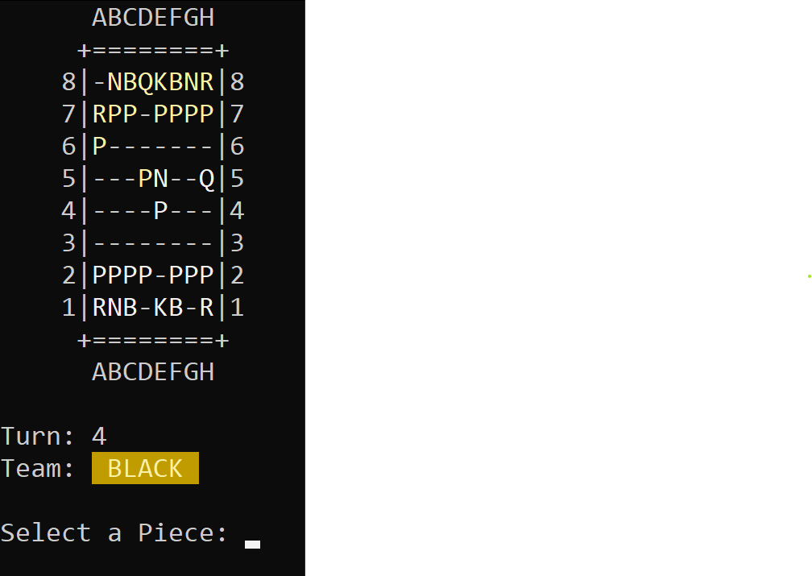

# Console Chess

    

Console Chess is a chess game played on console, because there are no graphics better than a black rectangle full of characters.

## Contribute

Please contribute! Issues and pull requests are welcome. **Thank you** for your help!

## License

Licensed under the [MIT License](./LICENSE).
